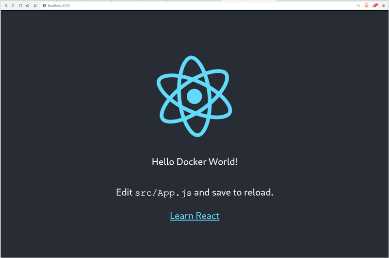

# Projeto Skillup

## Pré-requisitos

- Docker
- Docker Compose

## Configuração

### Passos para Configurar o Ambiente

1. **Crie um arquivo `.env` na raiz do projeto com o seguinte conteúdo:**

```dotenv
POSTGRES_DB=skillup_db
POSTGRES_USER=your_postgres_user
POSTGRES_PASSWORD=your_postgres_password
```
Realizar o passo 1 antes de iniciar os containers para que o `compose.yaml` possa criar o banco de dados.

### Iniciar os Containers Docker

1. **Inicie os containers:**

```sh
docker-compose up -d
```

### Verificar os Logs

Para verificar os logs dos containers, use os seguintes comandos:

1. **Logs do Container PostgreSQL:**

```sh
docker logs -f postgres_container
```

2. **Logs do Container Backend:**

```sh
docker logs -f skillup-backend-1
```

3. **Logs do Container Frontend:**

```sh
docker logs -f skillup-frontend-1
```

### Conclusão

Essas etapas devem garantir que o ambiente esteja configurado corretamente e que os containers estejam funcionando como esperado.

Project structure:
```
.
├── backend
│   ├── Dockerfile
│   ...
├── db
│   ...
├── frontend
│   ├── ...
│   └── Dockerfile
├── .env
├── .gitgnore
├── compose.yaml
├── README.md
```

[_compose.yaml_](compose.yaml)
```
services:
  backend:
    build: backend
    ...
  db:
    # We use a mariadb image which supports both amd64 & arm64 architecture
    image: mariadb:10.6.4-focal
    # If you really want to use MySQL, uncomment the following line
    #image: mysql:8.0.27
    ...
  frontend:
    build: frontend
    ports:
    - 3000:3000
    ...
```
The compose file defines an application with three services `frontend`, `backend` and `db`.
When deploying the application, docker compose maps port 3000 of the frontend service container to port 3000 of the host as specified in the file.
Make sure port 3000 on the host is not already being in use.

> ℹ️ **_INFO_**
> For compatibility purpose between `AMD64` and `ARM64` architecture, we use a MariaDB as database instead of MySQL.
> You still can use the MySQL image by uncommenting the following line in the Compose file
> `#image: mysql:8.0.27`

## Deploy with docker compose

```
$ docker compose up -d
Creating network "react-java-mysql-default" with the default driver
Building backend
Step 1/17 : FROM maven:3.6.3-jdk-11 AS builder
...
Successfully tagged react-java-mysql_frontend:latest
WARNING: Image for service frontend was built because it did not already exist. To rebuild this image you must use `docker-compose build` or `docker-compose up --build`.
Creating react-java-mysql-frontend-1 ... done
Creating react-java-mysql-db-1       ... done
Creating react-java-mysql-backend-1  ... done
```

## Expected result

Listing containers must show three containers running and the port mapping as below:
```
$ docker ps
ONTAINER ID        IMAGE                       COMMAND                  CREATED             STATUS              PORTS                  NAMES
a63dee74d79e        react-java-mysql-backend    "java -Djava.securit…"   39 seconds ago      Up 37 seconds                              react-java-mysql_backend-1
6a7364c0812e        react-java-mysql-frontend   "docker-entrypoint.s…"   39 seconds ago      Up 33 seconds       0.0.0.0:3000->3000/tcp react-java-mysql_frontend-1
b176b18fbec4        mysql:8.0.19                "docker-entrypoint.s…"   39 seconds ago      Up 37 seconds       3306/tcp, 33060/tcp    react-java-mysql_db-1
```

After the application starts, navigate to `http://localhost:3000` in your web browser to get a colorful message.


Stop and remove the containers
```
$ docker compose down
Stopping react-java-mysql-backend-1  ... done
Stopping react-java-mysql-frontend-1 ... done
Stopping react-java-mysql-db-1       ... done
Removing react-java-mysql-backend-1  ... done
Removing react-java-mysql-frontend-1 ... done
Removing react-java-mysql-db-1       ... done
Removing network react-java-mysql-default
```
